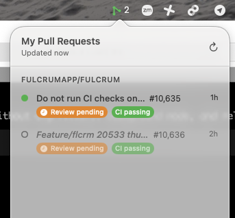
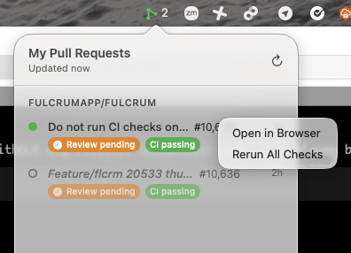

# PR Menu

A lightweight macOS menu bar app that shows your open GitHub pull requests at a glance.

## Screenshots

| Menu | Right-click actions |
|------|---------------------|
|  |  |

## Features

- **Menu bar icon** with color-coded status (green/orange/red/purple)
- **Auto-refresh** every 5 minutes
- **Grouped by repo** for easy scanning
- **Status badges** — CI status, review state, unresolved comment count
- **Click to open** any PR in your browser
- **Right-click → Rerun All Checks** via `gh run rerun`
- **Flash animation** when PR status changes
- **Org filtering** to scope to a specific GitHub org

### Icon colors

| State | Color |
|---|---|
| Changes requested | 🔴 Red |
| CI failing | 🔴 Red |
| Unresolved comments | 🟣 Purple |
| CI pending | 🟠 Orange |
| All clear | 🟢 Green |

## Prerequisites

- macOS 13+
- Swift 6.0+ (via Xcode or Command Line Tools)
- [GitHub CLI](https://cli.github.com/) (`gh`), authenticated

```sh
brew install gh
gh auth login
```

## Build

```sh
swift build
```

## Run

```sh
# Show PRs from all orgs
.build/debug/PRMenu

# Filter to a specific org
.build/debug/PRMenu --org fulcrumapp
```

The app runs as a menu bar icon — click it to open the PR list popover.

## Run in background

```sh
.build/debug/PRMenu --org fulcrumapp &
disown
```

## Release build

```sh
swift build -c release
cp .build/release/PRMenu /usr/local/bin/pr-menu
```
